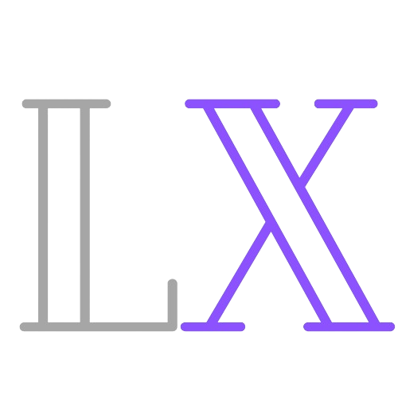

<div id="readme-top"></div>

<div align="center">
  <a href="https://github.com/boyandmtrv/Lexie">
    
  </a>

 <h1 align="center">Lexie</h1>

  <p align="center">
    Keep track of yourself
    <br />
    <a href="https://github.com/boyandmtrv/Lexie"><strong>Discover the docs</strong></a>
  </p>
</div>


<details>
  <summary>Table of Contents</summary>
  <ol>
    <li>
      <a href="#about-the-project">About The Project</a>
        <li><a href="#built-with">Built With</a></li>
    </li>
        <li><a href="#installation">Installation</a></li>
    <li><a href="#usage">Usage</a></li>
    <li><a href="#license">License</a></li>
    <li><a href="#contact">Contact</a></li>
  </ol>
</details>

## About The Project


Lexie is a simple and intuitive notes app that allows you to quickly jot down and organize your thoughts, tasks, and ideas. Whether you're a student, professional, or anyone who needs to keep track of information, Lexie makes it easy and secure.

Why Lexie?
* Simplified Note taking - Write, Edit, Delete notes with a matter of click
* Navigation with ease - Seamlessly move through the app with intuitive controls.
* Organize: Categorize and securely store notes in your personal section.
* Time span - Utilize Lexie as a task engine, adding time spans based on your preferences
* Type Related: categorizing personal or work thoughts and ideas.
* Security - each written note stays for yourself
* User Guidance: The 404 page is designed to guide users back to the right path, providing clear instructions on navigation. Recognizing the frustration of getting lost on a website, our 404 page ensures a smooth and user-centric experience.

In total, Lexie provides a simple and intuitive platform for quickly jotting down and organizing your thoughts, tasks, and ideas. With its user-centric design, Lexie caters to the diverse needs of individuals, making note-taking easy and enjoyable for everyone.

<p align="right">(<a href="#readme-top">back to top</a>)</p>

### Built With
[](https://html.com/) <br/>
[](https://developer.mozilla.org/en-US/docs/Web/CSS) <br/>
[](https://developer.mozilla.org/en-US/docs/Web/JavaScript) <br/>
[](https://expressjs.com/) <br/>
[](https://www.npmjs.com/package/express-handlebars) <br/>
[](https://www.mongodb.com/) <br />
[](https://www.npmjs.com/package/mongoose) <br />
[](https://www.npmjs.com/package/bcrypt) <br />
[](https://www.npmjs.com/package/cookie-parser) <br />
[](https://www.npmjs.com/package/jsonwebtoken) <br />
[](https://nodemon.io/) <br/>
[](https://www.npmjs.com/package/uniqid) <br />
[](https://www.npmjs.com/package/cors) <br/>
[](https://boxicons.com/)

<p align="right">(<a href="#readme-top">back to top</a>)</p>

## Getting Started

To get a local copy, follow these steps:
  
### Installation

1. Clone the repo
   ```sh
   git clone https://github.com/boyandmtrv/Lexie.git
   ```
2. Install NPM packages
   ```sh
   npm install
   ```

<p align="right">(<a href="#readme-top">back to top</a>)</p>

## Usage

### Run the app
1. Open a new terminal and enter the back-end folder
   ```sh
    cd .\back-end\
   ```
2. Run the application
   ```sh
   npm start
   ```
   
*To open the application locally, enter the following url in the browser field: http://localhost:5000/*

<p align="right">(<a href="#readme-top">back to top</a>)</p>

## License

Distributed under the MIT License. See `LICENSE` for more information.

<p align="right">(<a href="#readme-top">back to top</a>)</p>

## Contact

[](https://www.linkedin.com/in/boyan-dimitrov-4402b4179/) <br />
[](mailto:boyandimitrov1462@gmail.com) <br />
[](https://github.com/boyandmtrv) <br />

